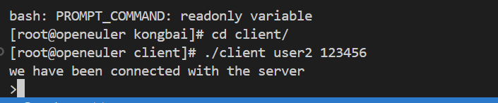
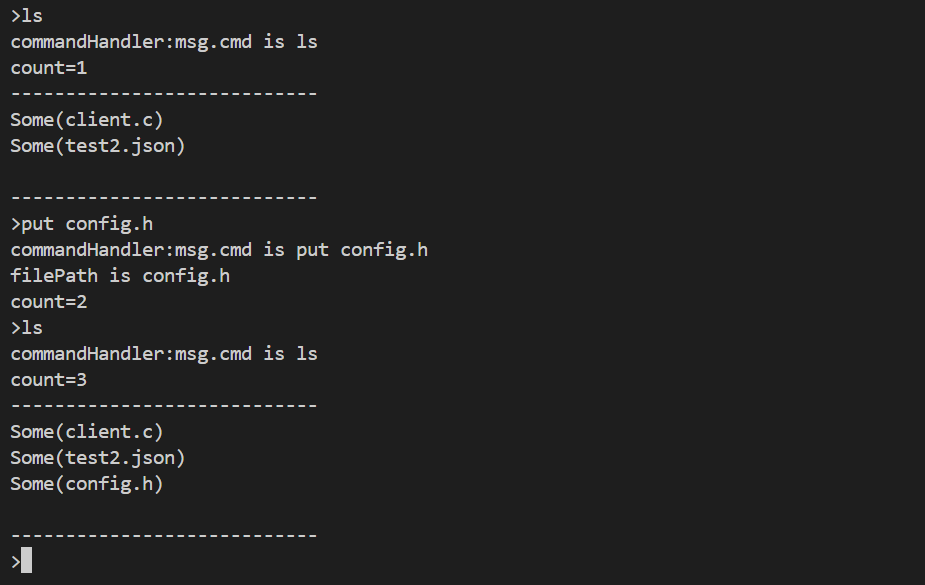

## 说明

目录结构：
- cangjie-ftp：使用仓颉编程语言开发的ftp服务端
    - 已完成：
        - ls、cd、pwd、quit、get、put、权限控制
    - 未完成：
        - 并发
- python-ftp：使用python开发的ftp服务器，已**全部**完成
- client：与cangjie-ftp配套的客户端程序，采用C语言编写

注：

- client中的程序参照：https://blog.csdn.net/HermanIu/article/details/134107201 ，只是进行了少量修改。cangjie-ftp的实现思路以及基本方法也是参考本教程，同时结合仓颉语言的特性进行代码实现工作。

- 目前cangjie-ftp并不支持同一IP未断开原有连接就进行新的连接，且并不支持ftp实现标准，只是一个简易的ftp服务端程序。

python-ftp的介绍请参考 `python-ftp` 目录下的 `README` 或者 `作品简介`

下面主要介绍一下 `cangjie-ftp` 服务端程序的功能，更加详细设计实现说明请参考 FTP服务器开发文档

## 仓颉FTP服务器

我们使用仓颉编程语言实现了FTP常见的几个命令工具，`ls`、`pwd`、`cd`、`get`以及`put`

### 运行ftp服务器

根目录以及`cangjie-ftp`目录下都已经提供脚本安装`cangjie`工具链，请注意使用`source run-ftp.sh`运行脚本，否则将导致环境变量设置无法生效。

```bash
#!/bin/bash  

# 定义下载地址和文件名  
DOWNLOAD_URL="https://cangjie-lang.cn/v1/files/auth/downLoad?nsId=142267&fileName=Cangjie-0.53.13-linux_x64.tar.gz&objectKey=6719f1eb3af6947e3c6af327"  
FILE_NAME="Cangjie-0.53.13-linux_x64.tar.gz"

# 检查 cangjie 工具链是否已安装

echo "确保 cangjie 工具链已安装..."  
if ! command -v cjc -v &> /dev/null  
then  
    echo "cangjie工具链 未安装，尝试进行安装..."  
    # 下载文件  
    echo "Downloading Cangjie compiler..."  
    curl -L -o "$FILE_NAME" "$DOWNLOAD_URL"

    # 检查下载是否成功  
    if [ $? -eq 0 ]; then  
        echo "Download completed successfully."  
    else  
        echo "Download failed."  
        exit 1  
    fi

    # 解压文件  
    echo "Extracting $FILE_NAME..."  
    tar -xvf "$FILE_NAME"  

    # 检查解压是否成功  
    if [ $? -eq 0 ]; then  
        echo "Extraction completed successfully."  
    else  
        echo "Extraction failed."  
        exit 1  
    fi

    # 检查 envsetup.sh 是否存在并进行 source  
    if [[ -f "cangjie/envsetup.sh" ]]; then
    	echo "envsetup.sh found!"  
        source cangjie/envsetup.sh  
    else  
        echo "envsetup.sh not found!"  
        exit 1  
    fi

fi

# 检查 /ftp_data 目录以及 user1 和 user2 子目录
echo "检查 /ftp_data 目录及子目录..."
if [ ! -d "/ftp_data" ]; then
    echo "/ftp_data 目录不存在，正在创建..."
    mkdir -p /ftp_data
fi

# 检查 user1 和 user2 子目录
for dir in user1 user2; do
    if [ ! -d "/ftp_data/$dir" ]; then
        echo "/ftp_data/$dir 目录不存在，正在创建..."
        mkdir "/ftp_data/$dir"
    fi
done

# 编译ftp_server
cjc ./cangjie-ftp/ftp_server.cj -o ftp_server

echo "正在启动ftp服务器..."

# 启动执行
./ftp_server
```

### ls

`ls` 用以列出所在目录下的文件以及目录


核心代码：

```cangjie
let info = currentDir().fileList()
var files: String = ""
for (file in info) {
    files += file.path.fileName.toString() + "\n"
}
client.write(("0" + files + '\0').toArray())
```

通过cangjie为我们提供的获取当前所在工作目录以及目录下文件的功能即可实现。

### cd

`cd`指令帮助我们进行工作目录的切换


核心代码：

```cangjie
// 更改当前工作路径
let dir = getDestDir(String(cmd))
chdir(dir)
client.write(("0change the dictory" + "\0").toArray())
```

只需获取命令中的路径将其设置为当前工作目录即可实现该功能

### pwd

`pwd`用以获知当前所在工作目录


核心代码：

```cangjie
// 获取当前路径
let path = currentDir().info.path.toString()
client.write(("0" + path + '\0').toArray())
```

同样可以使用cangjie已经为我们封装好的方法直接获取。

### get

`get`命令用以拉取文件将其下载到客户端本地


查看效果：


上述文件已被下载到本地。


文件内容也被正确传输下载下来

核心代码：

```cangjie
// 首先判断文件是否存在
let path: Path = Path(getDestDir(String(cmd)))
println(path)
let exists = File.exists(path)
if (exists) {
    // 文件存在，读取文件到dataBuf中
    let dataBuf = Array<Byte>(4096, item: 0)
    msg.fileFlag = 1
    // 以只读模式打开文件
    var file: File = File(path, OpenOption.Open(true, false))
    file.seek(SeekPosition.Begin(0))
    file.read(dataBuf)
    file.close()
    client.write((String.fromUtf8(msg.fileFlag) + String.fromUtf8(msg.cmd) + String.fromUtf8(dataBuf)).toArray())
} else {
    client.write("0file does not exist!\0".toArray())
}
```

主要逻辑就是首先判断文件是否存在，将其写入`socket`，客户端在另一端接收到数据后解析创建并写入本地文件即可。

### put

`put`用以上传文件到服务器


查看效果：


相关文件`client.c`已被上传到服务器。

核心代码：

```cangjie
// 首先判断文件是否存在
let path = getDestDir(String(cmd))
let exists = File.exists(path)
if (exists) {
    // 文件存在，先将其删除
    File.delete(path)
}
var file: File = File(path, OpenOption.Create(false))
if (File.exists(path)) {
    println("The file ${path} is created successfully in current directory.\n")
}
let bytes: Array<Byte> = msg.contentBuf
file.write(bytes)
file.close()
```

基本逻辑为首先判断文件是否存在，存在则将其删除，之后读取连接管道中的客户端传送来的文件数据并将其在服务器端创建文件并写入内容即可。

### 权限控制



客户端匿名用户登录无需用户名和密码参数，否则需要提供用户名和密码作为参数。

以user2为例



user2目录下可进行上传操作。


切换目录到user1下，发现既不可以查看也不可以下载上传，操作受限。

核心代码：

```cangjie
// 用以权限验证的类
struct User {  
    var username: String  
    var password: String

    public init(username:String, password:String) {
        this.username = username
        this.password = password
    }  
    // 用以根据用户名设置工作目录，请确保下面几个目录存在于计算机上
    public func setDir() {
        if (username == "user1") {
            chdir("/ftp_data")
        } else if (username == "user2") {
            chdir("/ftp_data/user2")
        } else {
            chdir("/ftp_data/user1")
        }
    }

    // 用户查看下载权限控制
    public func download() {
        // 进行用户权限的判断
        if (username == "anonymous" && !currentDir().info.path.toCanonical().toString().startsWith("/ftp_data/user1")) {
            // 匿名用户无权查看user2目录下内容
            return false
        } else if (username == "user2" && !currentDir().info.path.toCanonical().toString().startsWith("/ftp_data/user2")) {
            // user2无权查看这些目录下的文件
            return false
        }
        return true
    }

    // 用户上传权限控制
    public func upload() {
        if (username == "user1" && currentDir().info.path.toCanonical().toString().startsWith("/ftp_data/user1")) {
            return true
        } else if (username == "user2" && currentDir().info.path.toCanonical().toString().startsWith("/ftp_data/user2")) {
            // user2无权查看这些目录下的文件
            return true
        }
        return false
    }
}  
```

使用结构体并在其中定义用户上传以及下载的权限控制方法，具体实现为获取绝对路径，判断是否对该路径下的文件具有相应权限。