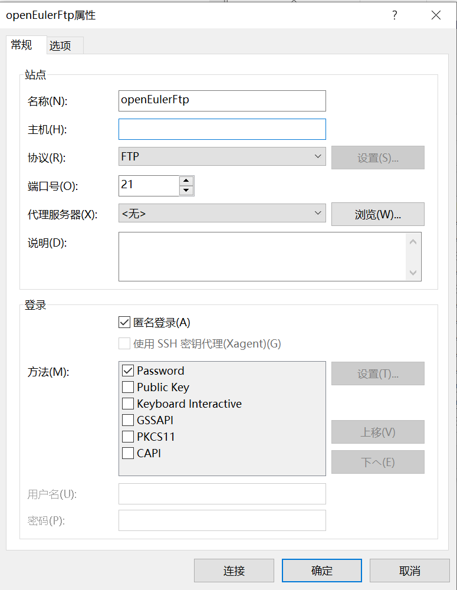
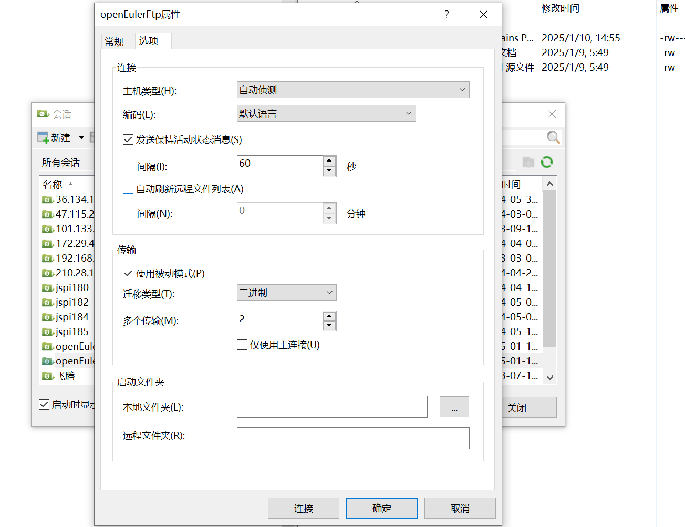
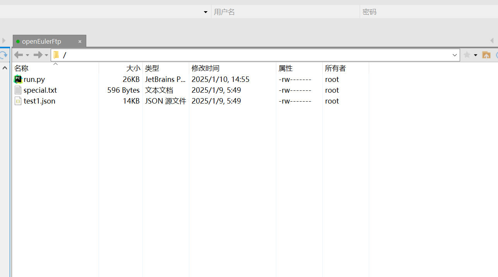
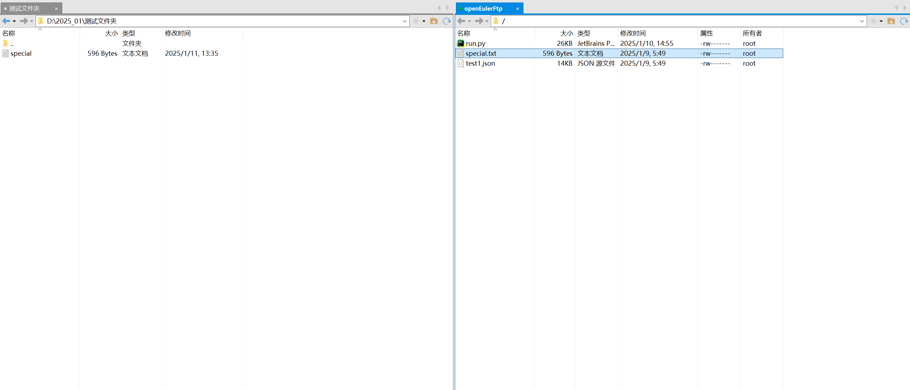
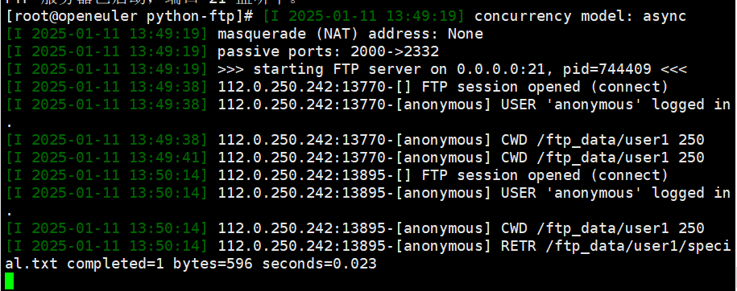
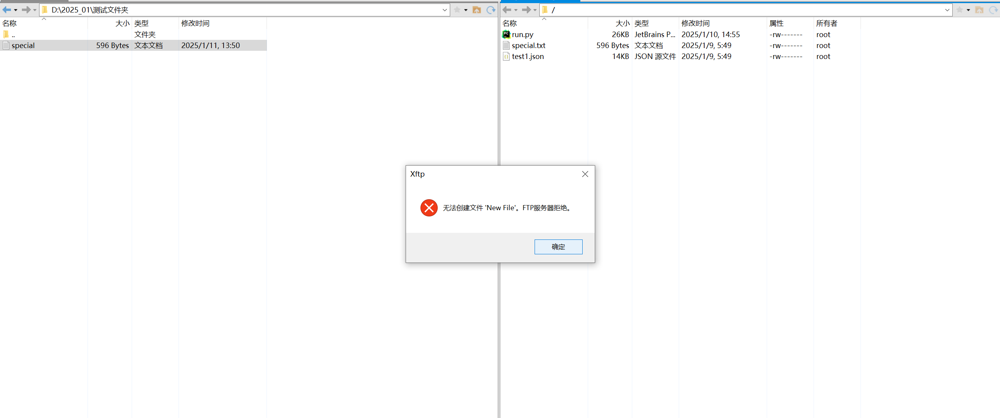
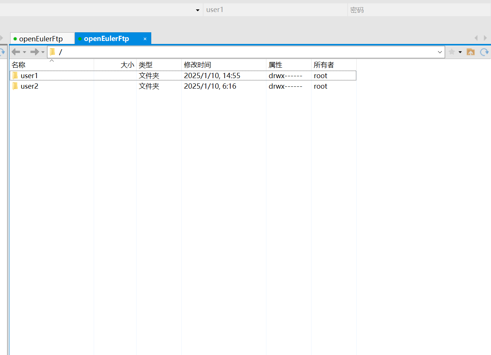
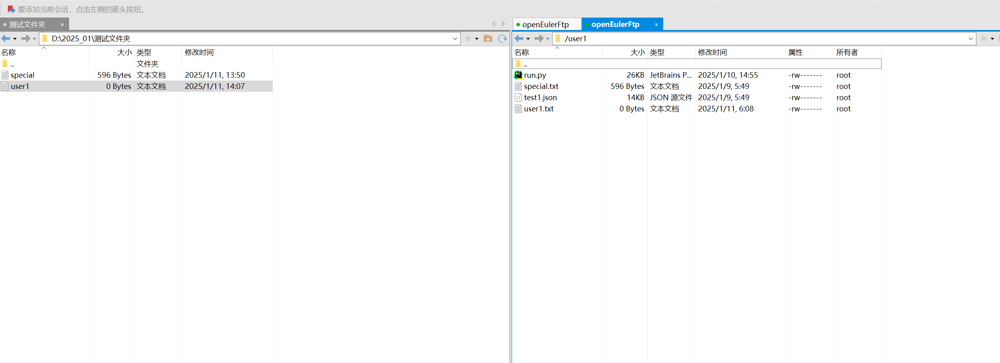
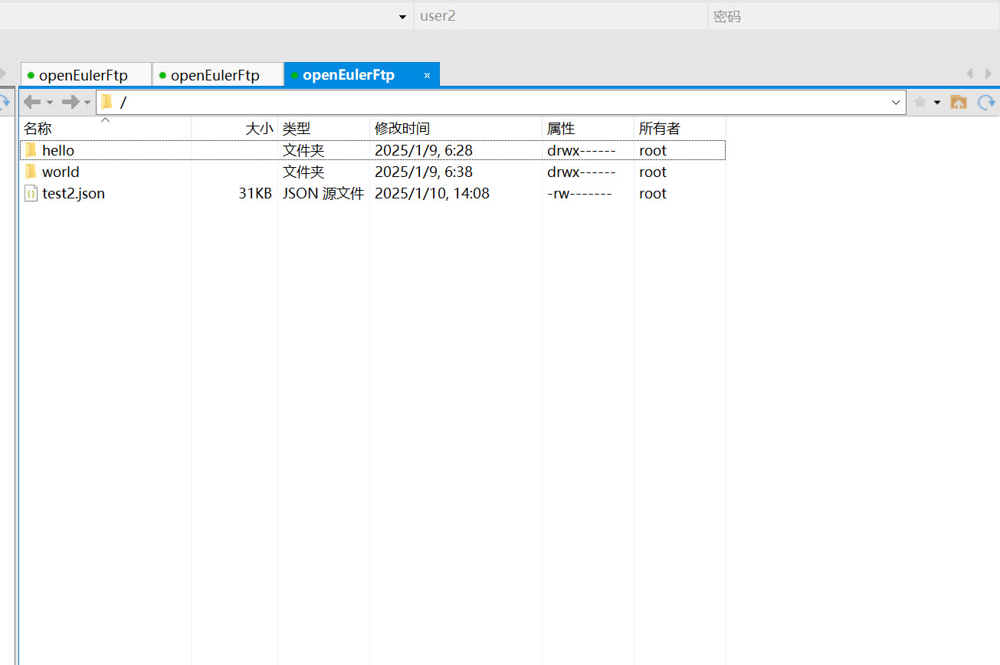
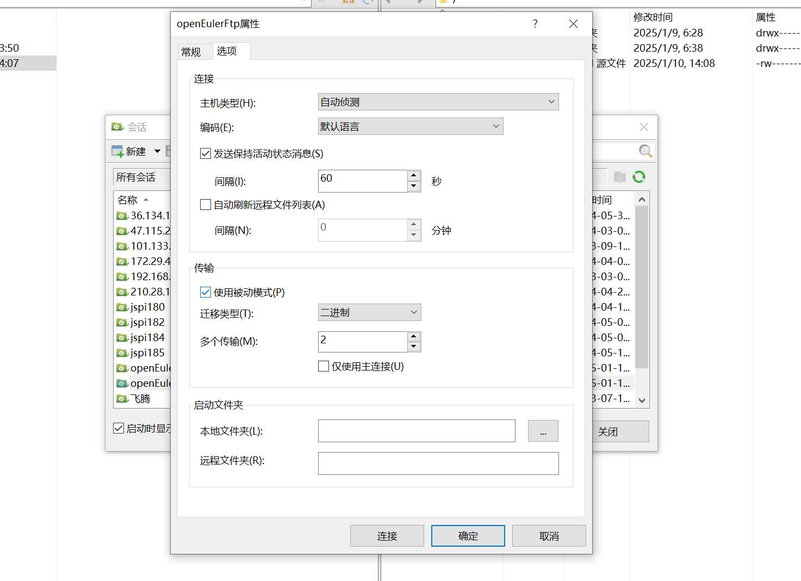

## 简介

本项目是一个基于 Python 的 FTP 服务器，使用 `pyftpdlib` 库构建。服务器支持多个用户连接和管理，提供灵活的权限控制以确保安全性和可用性。

## 功能

- 支持匿名用户和多个注册用户。
- 每个用户有不同的目录和权限。
- 支持文件上传、下载、删除及重命名操作。
- 权限控制：不同用户对文件和目录的访问权限不同。

## 技术栈

- Python 3.x
- pyftpdlib
- 可选：xftp（用于客户端连接测试）

## 安装

1. 确保您的系统已经安装 Python 3.x 和 pip（Python 包管理工具）。

2. 克隆或下载本项目后：
   ```bash
   cd <本目录>
   ```

## 配置

您可以根据需要修改 `ftp_server.py` 文件中的设置：

- **用户信息**：在 `CustomAuthorizer` 类中，您可以添加或修改用户的名称、密码和权限。
- **文件目录**：`homedir` 参数定义了每个用户的根目录，您可以根据实际需求进行修改。

```python
self.add_user("username", "password", homedir='/path/to/home/dir', perm='elradfmw')
```

### 权限说明

- `e`: 改变目录
- `l`: 列出目录
- `r`: 下载文件
- `a`: 上传文件
- `d`: 删除文件
- `f`: 改名文件
- `m`: 改变文件权限
- `w`: 写入文件

## 启动服务器

直接运行脚本启动 FTP 服务器：

```bash
bash run-ftp.sh
```

默认情况下，服务器运行在端口 21 ，请确保该端口入方向规则允许。

## 连接到 FTP 服务器

您可以使用 FTP 客户端（如 xftp）或命令行工具进行连接。

### 使用 Xftp

1. 下载并安装 Xftp 客户端

   

2. 在 Xftp 中输入以下连接信息：
   - **主机**：`127.0.0.1` 或 FTP 服务器的 IP 地址
   - **协议**：选择 `FTP`
   - **用户名**：`anonymous`(勾选匿名登录) 或其他用户如 `user1` 或 `user2`
   - **密码**：其他用户请使用相应密码
   - **端口**：`21`
3. 点击“连接”即可连接到服务器。

可使用主动模式或者被动模式连接到ftp服务器，请确保服务器端`2000-2332`端口对外开放。

   

## 测试

通过 FTP 客户端上传和下载文件，以确保权限和功能正常。

- **匿名用户**：仅可查看并下载user1上传的文件，不可上传文件。

   
   - 查看user1的文件

   
   - 下载user1上传的文件

   

   - 匿名用户不可上传和新建修改

   

- **注册用户**（如 `user1` 和 `user2`）：根据配置的权限进行操作。
   - `user1`账户可查看并下载自己上传的文件，及下载user2上传的文件。

      - `user1`可查看和下载`user1`和`user2`的文件
      

      - `user1`只可以上传文件到`user1`目录下
      

   - `user2`账户仅可查看并下载自己上传的文件。

      

- **使用被动模式**进行数据传输

   - 勾选使用被动模式
   

## 常见问题

- **无法连接到服务器**：确保服务器正在运行，并且没有防火墙阻止 21 端口的访问。
- **权限不足**：检查用户权限的配置，以确保用户可以执行所需的操作。
